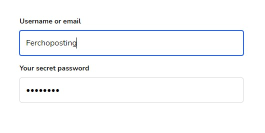

# Requirements
- Tailwind.css

# Installation
Install with npm
```shell
npm install @ferchoposting/formie
```

Import library and input
```js
import { Formie, inputs } from "@ferchoposting/formie";
```

Add components to tailwind purge components
### tailwind.config.js
```js
{
  ...
  purge: [
    ...,
    './node_modules/@ferchoposting/formie/**/*.vue',
  ],
}
```


# Introduction

### Create login form

```html
<template>
  <div class="max-w-md mt-12 mx-auto">
    <formie :form="form" />
  </div>
</template>


<script>
import { Formie } from "@ferchoposting/formie";

export default {
  components: {
    Formie,
  },

  setup() {
    const form = [
      // Username field
      {
        name: "username",
        label: "Username or email",
        type: "text",
      },
      // Password field
      {
        name: "password",
        label: "Your secret password",
        type: "password",
      },
    ];

    return { form };
  },
};
</script>
```

### The result will be a simple login form:



### Yeah but... How do I get the info?
Copy and paste the following code:
```html
<template>
  <div class="max-w-md mt-12 mx-auto">
    <formie :form="form" />
  </div>
</template>

<script>
import { Formie, inputs } from "@ferchoposting/formie";

export default {
  components: {
    Formie,
  },

  setup() {
    const form = [
      // Username field
      {
        name: "username",
        label: "Username or email",
        type: "text",
      },
      // Password field
      {
        name: "password",
        label: "Your secret password",
        type: "password",
      },
      // Buttons
      {
        type: inputs.Buttons,
        buttons: [
          {
            label: "Login",
            clicked(context) {
              alert(`User: ${context.values.username}!`);
            },
          },
        ],
      },
    ];

    return { form };
  },
};
</script>
```

The clicked function will be executed when button is clicked.


# Context object
```js
const context = {
  // Object containing the user input on fields.
  values: Object,
  
  // The <model> with existing data supplied to form.
  model: Object,

  // The form object returned in setup function
  form: Object,

  // Form errors returned by inertia
  errors: Object,
  
  // Shortcut to model.id if exists else null.
  id: [Number, null],
}
```


# Available inputs
```js
inputs.Buttons // Props: buttons
inputs.Default // Props: type
inputs.Checkbox // Props: default
inputs.Radio // Props: options
inputs.Select // Props: options
inputs.Textarea
inputs.Upload
```


# Create custom input
You can return **any** vue component to the `type` property on form fields object.

```js
import CustomImageUploader from './CustomImageUploader.vue';

const form = [
  {
    label: "Fancy image uploader",
    type: CustomImageUploader,
  }
]
```
### CustomImageUploader.vue

Props:

- `field`: Will be the object from the form (including label, type, etc)
- `value`: Will be the `modelValue` for fields, contains the model for the field.

Emits:
- `update`: Updates the value for the field `field`.


```html
<script>
export default {
  props: ["field", "value"],

  emits: ["update"],
}
</script>
```


# Copy paste example

### ProductController.php
```php
class ProductController extends Controller
{
    public function create()
    {
        return inertia('Backend/Products/CreateEdit');
    }
    
    public function edit($id)
    {
        $model = Product::findOrFail($id);
        return inertia('Backend/Products/CreateEdit', compact('model'));
    }
}
```


### CreateEdit.vue
```html
<template>
  <formie
    :form="form"
    :model="model"
    :errors="$page.props.errors"
    :debug="true"
  />
</template>

<script>
import { Formie } from "@ferchoposting/formie";

import form from './form.js';

export default {
  props: ['model'],

  components: {
    Formie,
  },
  
  setup (props) {
    return { form(props) };
  }
}
</script>
```


### form.js
```js
import { Inertia } from '@inertiajs/inertia';

import { inputs } from "@ferchoposting/formie";


const onDelete = ({ id }) => {
    if (id && confirm("Estas seguro?")) {
        const url = route('products.destroy', id);
        Inertia.delete(url);
    }
};

const onSubmit = ({ id, values }) => {
    const options = {
        preserveScroll: true,
        onSuccess: () => values.images_upload = null,
    };

    if (id) {
        const url = route('products.update', id);
        const data = {_method: 'PUT', ...values};
        Inertia.post(url, data, options);
    } else {
        const url = route('products.store');
        Inertia.post(url, values, options);
    }
}


export default (props) => [
  {
    name: "name",
    label: "Nombre del Producto",
    type: "text"
  },
  {
    name: "price",
    label: "Precio",
    type: "number"
  },
  {
    name: "description",
    label: "Descripción",
    type: inputs.Textarea
  },
  {
    name: "images_upload",
    label: "Imágenes",
    type: inputs.Upload,
    multiple: true,
  },
  {
    name: "category_id",
    label: "Categoría",
    type: inputs.Select,
    attrs: {
      class: "flex-col"
    },
    options: props.categories,
  },
  {
    type: inputs.Buttons,
    buttons: [
      // Delete async button
      function ({ id }) {
          if (id) {
            return {
              label: "Eliminar",
              class: "bg-red-700 text-white",
              clicked: onDelete,
            };
          }
      },

      // Save button
      {
        label: "Guardar",
        type: "submit",
        clicked: onSubmit,
      }
    ]
  }
];

```
